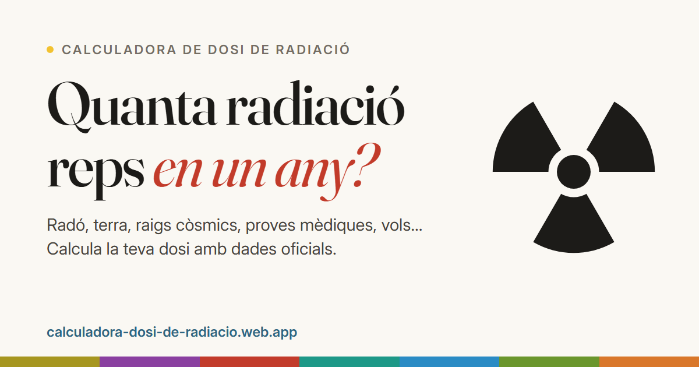

# Calculadora de dosi de radiació

**Quanta radiació reps en un any?** Calculadora divulgativa de la dosi anual de radiació ionitzant per a persones que viuen a Espanya: radó, radiació del terra, raigs còsmics, aliments, proves mèdiques, vols, tabac i feina.

👉 **https://calculadora-dosi-de-radiacio.web.app**



## Què fa

- Calcula la **dosi efectiva anual** estimada (en mSv) a partir d'unes preguntes senzilles i la compara amb la mitjana d'Espanya i amb una escala de referència (des d'un plàtan fins a les dosis agudes).
- Explica d'on ve cada dosi amb finestres de «més informació» i articles divulgatius (el radó, proves mèdiques i embaràs, riscos i límits legals, mites…).
- **Totes les xifres tenen font**: Consell de Seguretat Nuclear (CSN), UNSCEAR, ICRP, Atles Europeu de Radiació Natural, Comissió Europea… La bibliografia es mostra a la mateixa web, i els informes de recerca amb la justificació de cada valor són a [`docs/fonts/`](docs/fonts/).
- Funciona al mòbil, té mode fosc i no envia les respostes enlloc: tot es calcula al navegador.

## Història

Va néixer el 2023 com a **treball de recerca de 2n de batxillerat** de David Galan. El 2026 es va refer completament: disseny nou, totes les dades revisades amb fonts oficials (i diversos errors corregits) i molt més contingut divulgatiu. La versió original es conserva a l'etiqueta [`v1-batxillerat`](../../tree/v1-batxillerat).

## Desenvolupament

Web estàtica sense compilació: HTML, CSS i mòduls de JavaScript. Només cal [Node.js](https://nodejs.org) per als tests i Python per al servidor local.

```bash
npm start      # servidor local a http://localhost:5510
npm test       # tests (motor de càlcul, coherència de dades, textos i fonts)
npm run deploy # tests + publicació a Firebase Hosting
```

Estructura:

| Carpeta | Contingut |
|---|---|
| `public/` | La web (és l'única carpeta que es publica) |
| `public/js/data/` | Dosis de cada categoria, valors de referència i bibliografia |
| `public/js/i18n/` | Tots els textos (en català; preparat per traduir) |
| `public/js/` | Motor de càlcul i interfície |
| `docs/fonts/` | Informes de recerca amb l'origen de cada número |
| `tests/` | Tests amb el *test runner* de Node |
| `tools/` | Servidor local i generador de la imatge per a xarxes |

Si canvies alguna dosi, actualitza també l'informe corresponent de `docs/fonts/` i la font citada, i executa `npm test`.

## Avís

És una eina educativa: dona estimacions amb valors típics, no una mesura personal ni un consell mèdic.

## Autor

David Galan
